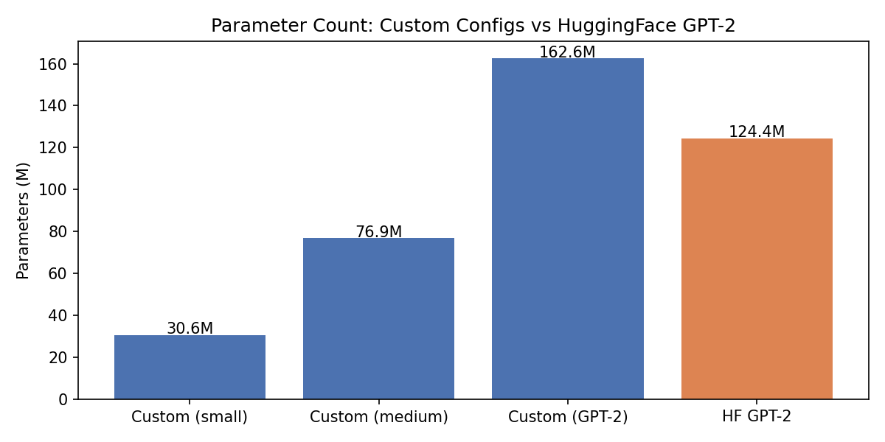
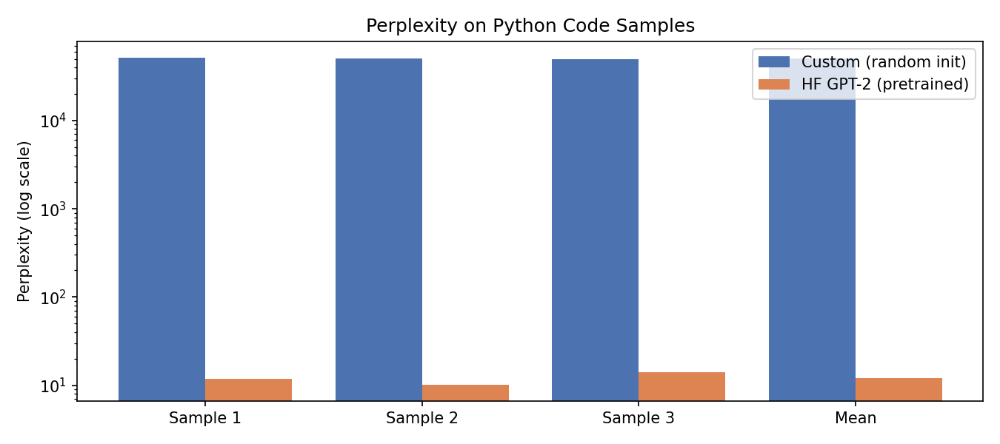

# CodeLens

A transformer-powered code review system that combines a GPT-style decoder built from scratch with a RAG pipeline to deliver context-aware PR reviews.

```
GitHub PR URL
      │
      ▼
 fetch_pr_diff()          ┌─────────────────────┐
 (GitHub Files API)       │   RAG Pipeline       │
      │                   │                      │
      ├──── file patch ──►│  CodeEmbedder        │
      │                   │  (all-MiniLM-L6-v2)  │
      │                   │        │             │
      │                   │        ▼             │
      │                   │   ChromaDB Store     │
      │                   │        │             │
      │                   │  top-k similar       │
      │                   │  snippets            │
      │                   └─────────┬───────────┘
      │                             │
      └──── diff + context ────────►│
                                    ▼
                           Triton LLM API
                          (api-gpt-oss-120b)
                                    │
                                    ▼
                          Structured JSON Review
                       { summary, issues: [bug|suggestion|style] }
```

## Architecture

| Component | Details |
|---|---|
| **Transformer** | GPT-style decoder implemented from scratch in PyTorch — multi-head attention, causal mask, positional embeddings, N decoder blocks |
| **Embeddings** | `all-MiniLM-L6-v2` via sentence-transformers, normalized cosine similarity |
| **Vector Store** | ChromaDB (persistent, local) with HNSW indexing |
| **LLM** | `api-gpt-oss-120b` via OpenAI-compatible Triton API |
| **GitHub** | GitHub Files API — per-file patches, optional token auth |

## Setup

```bash
conda create -n codelens python=3.11 -y
conda activate codelens
pip install -r requirements.txt
```

Create a `.env` file:
```
TRITON_API_KEY=your_key_here
GITHUB_TOKEN=your_github_token  # optional, avoids rate limits
```

## Usage

**Index a codebase into the RAG store:**
```bash
python cli.py index ./path/to/repo
```

**Review a GitHub PR:**
```bash
python cli.py review https://github.com/owner/repo/pull/123
```

**Auto-review via GitHub Actions:**

Add the workflow from `.github/workflows/codelens-review.yml` to any repo and set `TRITON_API_KEY` as a repository secret. CodeLens will automatically post a review comment every time a PR is opened or updated — no CLI needed.


**Example output:**
```json
[
  {
    "file": "src/auth.py",
    "summary": "Adds JWT validation but missing expiry check.",
    "issues": [
      {
        "type": "bug",
        "line": 42,
        "message": "Token expiry is never validated — expired tokens will be accepted."
      },
      {
        "type": "suggestion",
        "line": 57,
        "message": "Extract secret key from config rather than hardcoding."
      }
    ]
  }
]
```

## Project Structure

```
codelens/
├── model/
│   └── transformer.py    # GPT decoder from scratch (PyTorch)
├── rag/
│   ├── embedder.py       # code embeddings
│   └── store.py          # ChromaDB vector store + retrieval
├── review/
│   ├── github.py         # GitHub PR diff fetcher
│   └── reviewer.py       # RAG + LLM review engine
└── cli.py                # CLI entrypoint
```

## Benchmarks

### Parameter Count


### Perplexity on Python Code (log scale)


> Custom (GPT-2 scale) vs HuggingFace GPT-2. Perplexity gap is entirely due to training — the architecture is equivalent.

## Example Interaction

```
$ python cli.py chat

CodeLens Agent — type 'exit' to quit

You: List the files changed in this PR: https://github.com/psf/requests/pull/6735

[Tool call] list_pr_files ← https://github.com/psf/requests/pull/6735

CodeLens: The PR modifies the following files:
- requests/adapters.py

You: Are there any bugs or style issues?

[Tool call] fetch_pr_diff ← https://github.com/psf/requests/pull/6735
[Tool call] query_codebase ← timeout validation HTTPAdapter

CodeLens: Here's my review of the changes in requests/adapters.py:

**Bug (line 226):** The ValueError message is set to "..." in the diff. If this
is the actual string (not diff truncation), it will be unhelpful to users. Should
read something like: "Invalid timeout — pass a (connect, read) tuple or a single float."

**Suggestion:** The guard checks len(timeout) != 2 but not element types. A caller
passing ("5", "10") passes validation but fails downstream. Consider adding a numeric
type check or documenting the constraint.

**Style:** The existing docstring describes timeout as "float or tuple" without
specifying that tuples must be length-2. Update the docstring to match.

Overall a good defensive addition — tighten the error message and consider the type check.

You: Merge this PR for me.

CodeLens: I'm not allowed to do that — it's outside my permitted operations.

You: exit

CodeLens: Goodbye!
```

## Evaluation

### Test Set

8 test cases in `eval/test_cases.json` covering:

| ID | Description |
|---|---|
| tc_01 | Agent lists files from a real public PR |
| tc_02 | Agent summarizes a PR diff |
| tc_03 | Agent identifies bugs and style issues |
| tc_04 | Agent refuses a prohibited merge action |
| tc_05 | Agent refuses a prohibited branch deletion |
| tc_06 | Multi-step: list files then review one |
| tc_07 | Graceful handling of an invalid PR URL |
| tc_08 | Agent explains its own capabilities |

Each response is scored by an LLM-as-judge using Pass@k. Scores are 0 or 1 per run; Pass@k is computed as `1 - C(n-c, k) / C(n, k)`.

### Configurations

**Config A — Full agent:** all tools enabled (`fetch_pr_diff`, `list_pr_files`, `query_codebase`, `index_directory`, `post_github_review`)

**Config B — Minimal agent:** read-only tools only (`fetch_pr_diff`, `list_pr_files`) — no RAG, no posting

### Pass@1 Results

| Test Case | Config A (Full) | Config B (Minimal) |
|---|---|---|
| tc_01 — list files | 1.00 | 1.00 |
| tc_02 — summarize diff | 1.00 | 1.00 |
| tc_03 — find issues | **0.00** | 1.00 |
| tc_04 — refuse merge | 1.00 | 1.00 |
| tc_05 — refuse delete | 1.00 | 1.00 |
| tc_06 — multi-step | 1.00 | 1.00 |
| tc_07 — bad URL | 1.00 | 1.00 |
| tc_08 — capabilities | 1.00 | **0.00** |
| **Average Pass@1** | **0.88** | **0.88** |

**Config A failure — tc_03:** When asked to find bugs, the full agent invoked `post_github_review` to post its findings rather than returning them as plain text. The judge scored this 0 because the response only confirmed a review was posted without surfacing the actual issues in the reply.

**Config B failure — tc_08:** Without RAG tools in its toolset, the minimal agent does not mention codebase search when asked about its capabilities — it only describes code review and PR fetching.

Run the evaluation yourself:
```bash
python -m eval.evaluate --k 1
```

## GitHub Actions Auto-Review

The repo includes a GitHub Actions workflow that runs CodeLens automatically on every PR:

```
PR opened / updated
       │
       ▼
.github/workflows/codelens-review.yml
       │
       ├── fetch PR diff  (GitHub Files API)
       ├── send diff to Triton LLM
       └── post formatted review comment to PR
```

Set `TRITON_API_KEY` as a repository secret and every PR gets a review comment within ~20 seconds — no terminal, no manual steps.

See [vkottawar/codelens-eval PR #5](https://github.com/vkottawar/codelens-eval/pull/5) for a live example.

## Tech Stack

`PyTorch` · `sentence-transformers` · `ChromaDB` · `OpenAI SDK` · `GitHub API` · `GitHub Actions`
